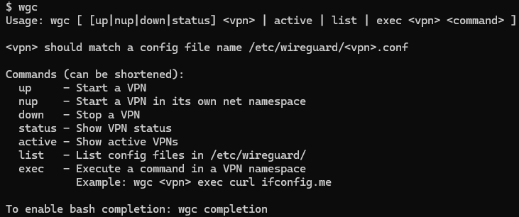
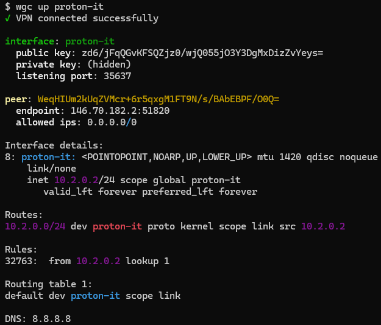
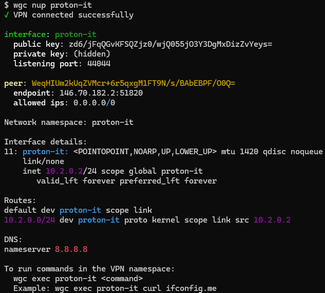
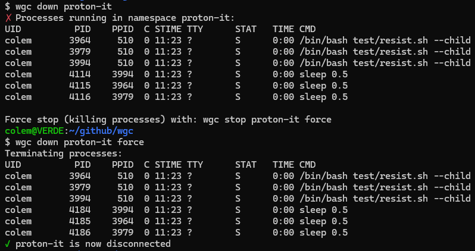
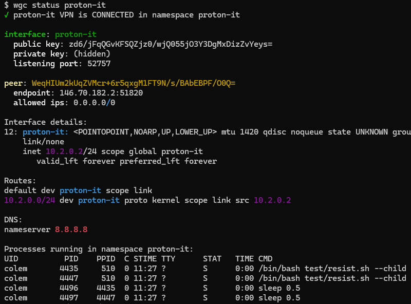
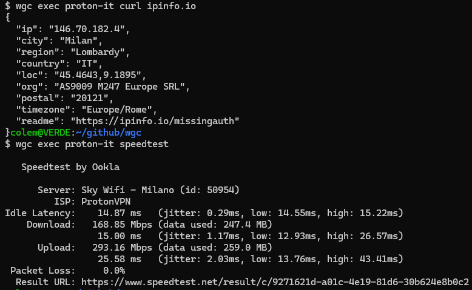
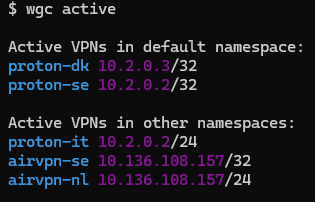

#  wgc - WireGuard Connection Manager


**[🇬🇧 English](README.md) | [🇮🇹 Italiano](README.it.md)**

> Run and monitor multiple isolated WireGuard tunnels using Linux network namespaces.

`wgc` is a bash script for managing multiple, simultaneous WireGuard connections on a Linux system. Its core feature is the ability to run VPNs either in **isolated network namespaces** (`ip netns`) or in the default namespace with policy-based routing.

Each VPN connection can be brought up in an isolated namespace with its own network interface, routing table, and DNS configuration, or in the default namespace using source-based routing rules. This allows multiple VPNs to be active concurrently without route conflicts.

---

## Features

* **Dual Operation Modes:** 
  * **Namespace mode (`nup`):** Complete isolation with dedicated namespace, perfect for running specific applications through the VPN.
  * **Default mode (`up`):** Uses the system's default namespace with policy-based routing, ideal for system-wide VPN usage.
* **Total Isolation:** Run multiple VPNs simultaneously in namespace mode. Each VPN's traffic is completely separate from the host and other VPNs.
* **Targeted Execution:** Run specific commands or applications (like `curl`, `ssh`, `bash`, a browser, a service) *inside* a VPN namespace. This routes only that application's traffic through the tunnel.
* **Automatic DNS:** Automatically configures DNS servers specified in the `.conf` file (via the `DNS =` key).
* **Smart Process Management:** Graceful termination of processes running in namespaces with timeout and progress indication.
* **Flexible Stopping:** Option to force-stop VPNs even when processes are running in their namespace.
* **Simple Interface:** A single script with clear commands to start, stop, list, and monitor tunnels.

## Requirements

* `bash`
* `sudo` access (the script auto-elevates if not run as root) 
* `wireguard-tools` (provides the `wg` command) 
* `iproute2` (provides the `ip` command)
* `systemd` (provides the `resolvectl` command for DNS management)

## Installation

1. Download file [wgc](https://github.com/colemar/wgc/raw/refs/heads/main/wgc)

2. Make the script executable:
   
   ```bash
   chmod +x wgc
   ```

3. Move the script to a directory in your `$PATH`, such as `/usr/local/bin`:
   
   ```bash
   sudo cp wgc /usr/local/bin/wgc
   ```

## Configuration

Your WireGuard configuration files (`.conf`) must be placed in `/etc/wireguard/`. 

The script uses the filename (without the `.conf` extension) as the VPN identifier. For example, a file at `/etc/wireguard/proton-it.conf` will be managed as the `proton-it` VPN.

**Note:** Config files named with the pattern `wg[0-9]+` (e.g., `wg0.conf`, `wg1.conf`) are excluded from management to avoid conflicts with system interfaces.

The script parses the file and expects standard WireGuard keys:

* **Required Keys:** The script will exit if any of these is missing:
  * `Address` 
  * `PrivateKey` 
  * `PublicKey` 
  * `Endpoint` 
  * `AllowedIPs` 
* **Optional Keys:** The script also supports:
  * `DNS`
  * `MTU` 
  * `PresharedKey` 
  * `PersistentKeepalive` 

---

## Usage

The general syntax is `wgc [command] <vpn_name>`.

The script requires `sudo` or root access because it manipulates network interfaces and namespaces.

  

### Main Commands

* **`up <vpn>`**
  Starts the VPN connection in the **default namespace** using policy-based routing. The VPN's routes are applied based on the source address, allowing the VPN to coexist with your normal network connection.
  
  This means that if you are connected to an headless host, your ssh session will not close if you start a VPN.
  
  This also means that an application (e.g. qBittorrent) must bind to the VPN interface or ip address to have its network traffic redirected through the tunnel.
  
  ```bash
  wgc up proton-it
  ```
  
  

* **`nup <vpn>`**
  Starts the VPN connection in its **own isolated namespace**. This provides complete network isolation and is the recommended mode for running specific applications through the VPN.
  
  Note that network services listening on TCP ports (such as web interfaces) will be isolated and unreachable from the host unless you explicitly set up port forwarding. Interactive applications with GUI or terminal interfaces are not affected by this limitation.
  
  ```bash
  wgc nup proton-it
  ```
  
  

* **`down <vpn> [force]`**
  Stops the VPN connection.
  
  * If the VPN is active in the default namespace, stops it.
  * If the VPN is active in its own namespace (started with `nup`):
    * If no processes are running in the same namespace, stops the VPN.
    * If some processes are running in the same namespace, shows the process list and refuses to stop the VPN.  If you specify `force`, gracefully terminates all processes in the namespace (SIGTERM), waits up to 10 seconds with a progress bar, then forcibly kills remaining processes (SIGKILL). Finally, stops the VPN.
  
  ```bash
  wgc down proton-it
  wgc down proton-it force
  ```
  
  

* **`status <vpn>`**
  Shows the detailed status of the connection, including:
  
  * Connection state and namespace
  * WireGuard interface details
  * IP addresses and routes
  * DNS configuration
  * Running processes (for namespace mode)
  
  ```bash
  wgc status proton-it
  ```
  
  

* **`exec <vpn> <command...>`**
  Executes a command *inside* the VPN's namespace. This only works for VPNs started with `nup`.
  
    *Example: Check your public IP as seen by the VPN.*
  
  ```bash
  wgc exec proton-it curl ipinfo.io
  ```
  
    *Example: Start an interactive shell that uses the VPN.*
  
  ```bash
  wgc exec proton-it bash
  ```
  
  

* **`list`**
  Lists all available `.conf` files found in `/etc/wireguard/` with their key configuration details (Address, AllowedIPs, Endpoint). 
  
  ```bash
  wgc list
  ```
  
  

* **`active`**
  Lists all *currently active* VPNs, showing both those in the default namespace and those in isolated namespaces.
  
  ```bash
  wgc active
  ```
  
  

### Command Shortcuts

All commands support prefix matching. For example:

* `up`, `u` → `up`
* `nup`, `nu`, `n` → `nup`
* `down`, `dow`, `do`, `d` → `down`
* `status`, `stat`, `st`, `s` → `status`
* `exec`, `exe`, `ex`, `e` → `exec`
* `active`, `activ`, `act`, `ac`, `a` → `active`
* `list`, `lis`, `li`, `l` → `list`

### Bash Completion

The script can install its own bash completion file with intelligent suggestions:

1. Run the following command:
   
   ```bash
   wgc completion
   ```

2. This will create the file `/etc/bash_completion.d/wgc`. 

3. Source the file or start a new shell to use the completion:
   
   ```bash
   source /etc/bash_completion.d/wgc
   ```

4. The completion provides:
   
   * Command name completion
   * VPN name completion based on available config files (for `up`/`nup`)
   * Active VPN completion (for `down`/`status`/`exec`)
   * System command completion after `exec <vpn>`

5. To avoid sudo password prompts during completion, the installer provides optional `sudoers` rules.

## Operation Modes Comparison

| Feature           | Default Namespace (`up`)              | Isolated Namespace (`nup`) |
| ----------------- | ------------------------------------- | -------------------------- |
| Network isolation | Partial (routing rules).              | Complete.                  |
| DNS configuration | System-wide.                          | Namespace-specific.        |
| Process execution | Direct.                               | Via `wgc exec`.            |
| Multiple VPNs     | Possible, with distinct ip addresses. | Simple and clean.          |
| Use case          | System-wide VPN.                      | Application-specific VPN.  |

## Examples

### Running a browser through VPN

```bash
# Start VPN in namespace
wgc nup proton-it

# Launch Firefox in the VPN namespace
wgc exec proton-it firefox

# When done, stop the VPN (will ask to force if Firefox is running)
wgc down proton-it force
```

### Checking VPN connectivity

```bash
# Your real IP
curl ipinfo.io

# IP as seen through the VPN, if started with 'up'
curl --interface proton-it ipinfo.io
curl --interface 10.2.0.2 ipinfo.io

# IP as seen through the VPN, if started with 'nup'
wgc exec proton-it curl ipinfo.io
```

### Multiple simultaneous VPNs

```bash
# Start multiple VPNs in their own namespaces
wgc nup vpn1
wgc nup vpn2
wgc nup vpn3

# List all active VPNs
wgc active

# Use different VPNs for different applications
wgc exec vpn1 firefox
wgc exec vpn2 bash # then whatever command suits you
```

## Troubleshooting

### Config file parsing

The script validates configuration files and reports:

* Missing required keys
* Unknown sections or keys (as warnings)
* Malformed lines
* Invalid DNS server addresses

### Process management

When stopping a namespace VPN with running processes:

1. First attempt shows the list of processes
2. Use `force` parameter to terminate them
3. Script tries graceful termination (SIGTERM)
4. Progress bar shows 10-second timeout
5. Remaining processes are forcibly killed (SIGKILL)

### DNS issues

* In namespace mode: DNS is configured in `/etc/netns/<vpn_name>/resolv.conf`
* In default mode: DNS is set via `resolvectl`
* Invalid DNS addresses are detected and skipped with warnings

## License

This project is licensed under the GNU General Public License v3.0 (GPL-3.0).
See the [LICENSE](LICENSE) file for details.
